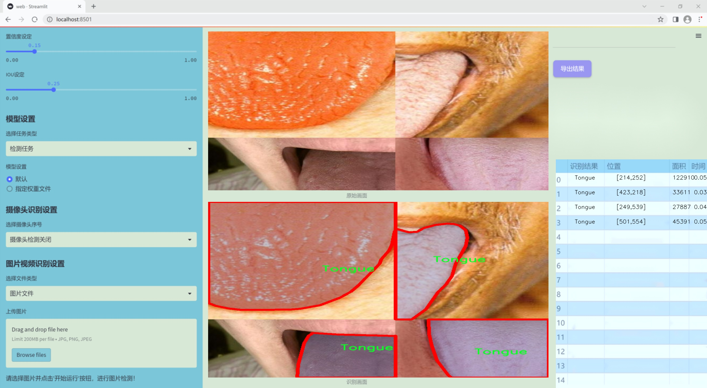
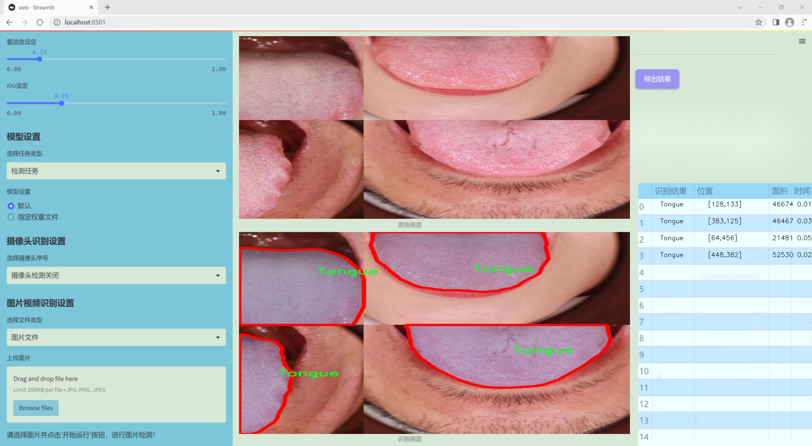
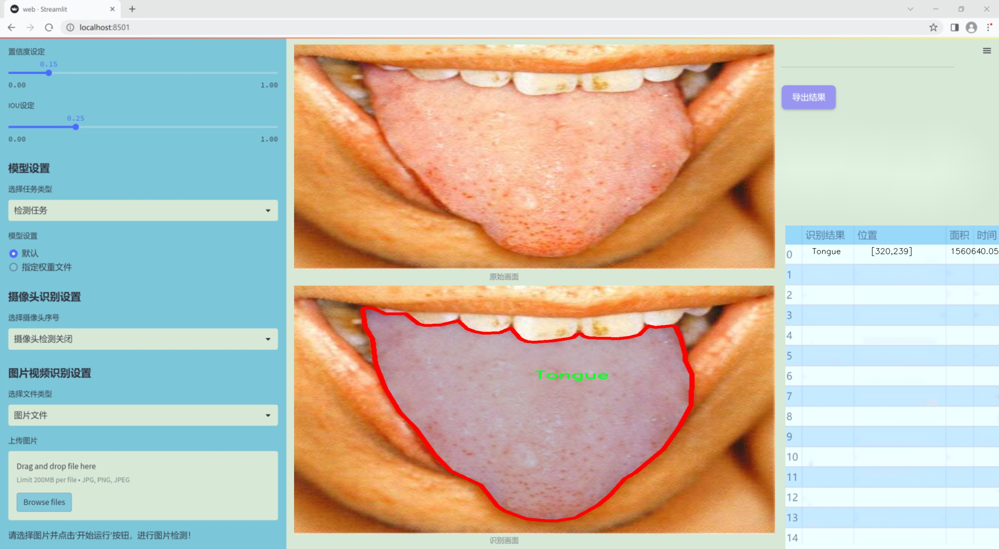
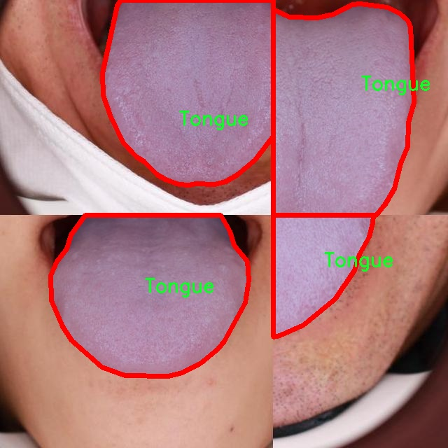
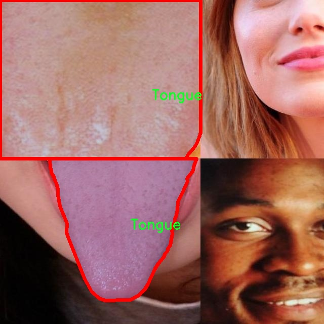
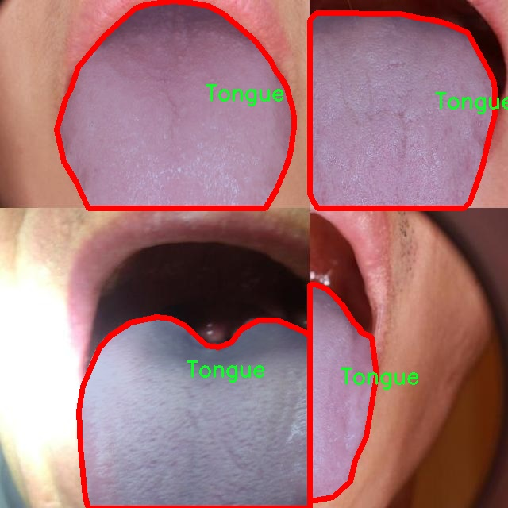
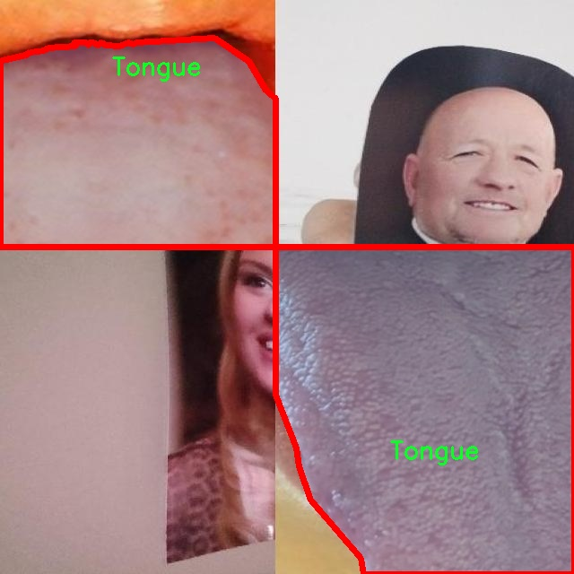
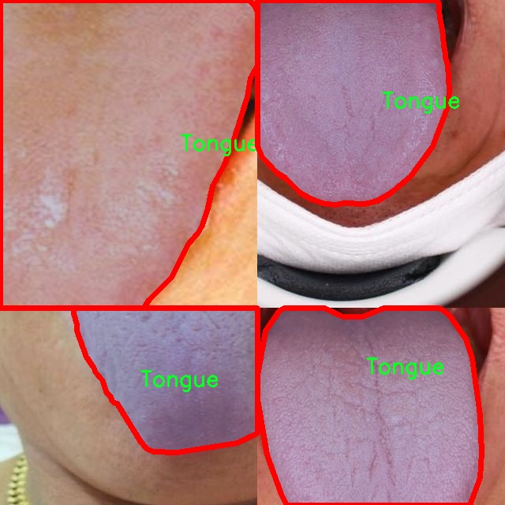

### 1.背景意义

研究背景与意义

舌头作为人体的重要器官，不仅在消化过程中发挥着关键作用，还在语言、味觉及健康状态的反映中扮演着不可或缺的角色。近年来，随着计算机视觉技术的迅猛发展，基于图像处理的舌头区域分析逐渐成为医学研究和临床诊断中的一个重要方向。舌头的形态、颜色及表面特征常常与多种疾病的发生密切相关，因此，开发高效的舌头区域图像分割系统对于早期疾病诊断和健康监测具有重要的现实意义。

本研究旨在基于改进的YOLOv11模型，构建一个高效的舌头区域图像分割系统。通过对舌头图像进行精确的分割，不仅可以提取出舌头的形态特征，还可以为后续的医学分析提供可靠的数据支持。我们的数据集包含9339张经过精心标注的舌头图像，且采用了YOLOv8格式进行标注，这为模型的训练和验证提供了坚实的基础。数据集的单一类别“舌头”使得模型能够专注于舌头区域的特征提取，提升分割的准确性和效率。

在数据预处理阶段，我们对图像进行了自动方向调整和统一尺寸处理，以确保输入数据的一致性。同时，通过数据增强技术生成多版本图像，进一步丰富了训练样本的多样性。这些措施不仅提高了模型的鲁棒性，还为其在实际应用中的推广奠定了基础。

总之，基于改进YOLOv11的舌头区域图像分割系统的研究，不仅推动了计算机视觉技术在医学领域的应用，也为舌头相关疾病的早期诊断提供了新的思路和方法，具有重要的学术价值和应用前景。

### 2.视频效果

[2.1 视频效果](https://www.bilibili.com/video/BV1gJm8YbEAd/)

### 3.图片效果







##### [项目涉及的源码数据来源链接](https://kdocs.cn/l/cszuIiCKVNis)**

注意：本项目提供训练的数据集和训练教程,由于版本持续更新,暂不提供权重文件（best.pt）,请按照6.训练教程进行训练后实现上图演示的效果。

### 4.数据集信息

##### 4.1 本项目数据集类别数＆类别名

nc: 1
names: ['Tongue']


该项目为【图像分割】数据集，请在【训练教程和Web端加载模型教程（第三步）】这一步的时候按照【图像分割】部分的教程来训练

##### 4.2 本项目数据集信息介绍

本项目数据集信息介绍

本项目旨在改进YOLOv11的舌头区域图像分割系统，因此构建了一个专门针对舌头形状分割的高质量数据集。该数据集的主题为“Tongue Shape Seg with Null”，主要集中于舌头的形状和结构特征，以支持更精准的图像分割任务。数据集中包含了丰富的舌头图像样本，涵盖了不同个体、不同光照条件和不同舌头状态下的舌头图像。这些图像经过精心标注，确保了舌头区域的准确性和一致性，为模型的训练提供了坚实的基础。

在类别设置方面，本数据集仅包含一个类别，即“Tongue”。这一设计选择使得模型在训练过程中能够专注于舌头区域的特征提取与分割，而不受其他类别的干扰。通过集中于单一类别，模型可以更深入地学习舌头的形状变化、边缘特征以及在不同环境下的表现，从而提高分割的准确性和鲁棒性。此外，数据集中还包含了一些标注为“Null”的样本，这些样本在训练中起到负样本的作用，帮助模型更好地区分舌头与背景，从而进一步提升分割效果。

数据集的构建遵循严格的标准，确保每个图像都经过专业的标注人员进行审核，保证数据的高质量和可靠性。通过使用这一数据集，研究人员可以有效地训练和评估改进后的YOLOv11模型，使其在舌头区域图像分割任务中表现出色。总之，本项目的数据集为舌头形状分割提供了一个全面而系统的基础，期待其在相关研究和应用中发挥重要作用。











### 5.全套项目环境部署视频教程（零基础手把手教学）

[5.1 所需软件PyCharm和Anaconda安装教程（第一步）](https://www.bilibili.com/video/BV1BoC1YCEKi/?spm_id_from=333.999.0.0&vd_source=bc9aec86d164b67a7004b996143742dc)


[5.2 安装Python虚拟环境创建和依赖库安装视频教程（第二步）](https://www.bilibili.com/video/BV1ZoC1YCEBw?spm_id_from=333.788.videopod.sections&vd_source=bc9aec86d164b67a7004b996143742dc)

### 6.改进YOLOv11训练教程和Web_UI前端加载模型教程（零基础手把手教学）

[6.1 改进YOLOv11训练教程和Web_UI前端加载模型教程（第三步）](https://www.bilibili.com/video/BV1BoC1YCEhR?spm_id_from=333.788.videopod.sections&vd_source=bc9aec86d164b67a7004b996143742dc)


按照上面的训练视频教程链接加载项目提供的数据集，运行train.py即可开始训练



     Epoch   gpu_mem       box       obj       cls    labels  img_size
     1/200     20.8G   0.01576   0.01955  0.007536        22      1280: 100%|██████████| 849/849 [14:42<00:00,  1.04s/it]
               Class     Images     Labels          P          R     mAP@.5 mAP@.5:.95: 100%|██████████| 213/213 [01:14<00:00,  2.87it/s]
                 all       3395      17314      0.994      0.957      0.0957      0.0843

     Epoch   gpu_mem       box       obj       cls    labels  img_size
     2/200     20.8G   0.01578   0.01923  0.007006        22      1280: 100%|██████████| 849/849 [14:44<00:00,  1.04s/it]
               Class     Images     Labels          P          R     mAP@.5 mAP@.5:.95: 100%|██████████| 213/213 [01:12<00:00,  2.95it/s]
                 all       3395      17314      0.996      0.956      0.0957      0.0845

     Epoch   gpu_mem       box       obj       cls    labels  img_size
     3/200     20.8G   0.01561    0.0191  0.006895        27      1280: 100%|██████████| 849/849 [10:56<00:00,  1.29it/s]
               Class     Images     Labels          P          R     mAP@.5 mAP@.5:.95: 100%|███████   | 187/213 [00:52<00:00,  4.04it/s]
                 all       3395      17314      0.996      0.957      0.0957      0.0845


###### [项目数据集下载链接](https://kdocs.cn/l/cszuIiCKVNis)

### 7.原始YOLOv11算法讲解

YOLOv11是一种由Ultralytics公司开发的最新一代目标检测模型，以其增强的特征提取能力和更高的效率在计算机视觉领域引人注目。该模型在架构上进行了关键升级，通过更新主干和颈部结构，显著提高了对复杂视觉场景的理解和处理精度。YOLOv11不仅在目标检测上表现出色，还支持实例分割、图像分类、姿态估计和定向目标检测（OBB）等任务，展示出其多功能性。

与其前身YOLOv8相比，YOLOv11在设计上实现了深度和宽度的改变，同时引入了几个创新机制。其中，C3k2机制是对YOLOv8中的C2f的改进，提升了浅层特征的处理能力；C2PSA机制则进一步优化了特征图的处理流程。解耦头的创新设计，通过增加两个深度卷积（DWConv），提高了模型对细节的感知能力和分类准确性。

在性能上，YOLOv11m模型在COCO数据集上的平均精度（mAP）提高，并减少了22%的参数量，确保了在运算效率上的突破。该模型可以部署在多种平台上，包括边缘设备、云平台以及支持NVIDIA GPU的系统，彰显出卓越的灵活性和适应性。总体而言，YOLOv11通过一系列的创新突破，对目标检测领域产生了深远的影响，并为未来的开发提供了新的研究方向。


****文档**** ： _ _https://docs.ultralytics.com/models/yolo11/__

****代码链接**** ： _ _https://github.com/ultralytics/ultralytics__

******Performance Metrics******


​ ** **关键特性****

****◆**** ** **增强的特征提取能力**** ：YOLO11采用了改进的主干和颈部架构，增强了 ** **特征提取****
能力，能够实现更精确的目标检测和复杂任务的执行。

****◆**** ** **优化的效率和速度****
：YOLO11引入了精细化的架构设计和优化的训练流程，提供更快的处理速度，并在准确性和性能之间保持最佳平衡。

****◆**** ** **参数更少、精度更高****
：通过模型设计的改进，YOLO11m在COCO数据集上实现了更高的平均精度（mAP），同时使用的参数比YOLOv8m少22%，使其在计算上更加高效，而不牺牲准确性。

****◆**** ** **跨环境的适应性**** ：YOLO11可以无缝部署在各种环境中，包括边缘设备、云平台和支持NVIDIA
GPU的系统，确保最大的灵活性。

****◆**** ** **支持广泛任务****
：无论是目标检测、实例分割、图像分类、姿态估计还是定向目标检测（OBB），YOLO11都旨在应对一系列计算机视觉挑战。

****支持的任务和模式****


​YOLO11建立在YOLOv8中引入的多功能模型范围之上，为各种计算机视觉任务提供增强的支持:


​该表提供了YOLO11模型变体的概述，展示了它们在特定任务中的适用性以及与Inference、Validation、Training和Export等操作模式的兼容性。从实时检测到复杂的分割任务
，这种灵活性使YOLO11适用于计算机视觉的广泛应用。

##### yolov11的创新

■ yolov8 VS yolov11

YOLOv5，YOLOv8和YOLOv11均是ultralytics公司的作品，ultralytics出品必属精品。


​ **具体创新点** ：

**① 深度（depth）和宽度 （width）**

YOLOv8和YOLOv11是基本上完全不同。

**② C3k2机制**

C3k2有参数为c3k，其中在网络的浅层c3k设置为False。C3k2就相当于YOLOv8中的C2f。


​ **③ C2PSA机制**

下图为C2PSA机制的原理图。


​ **④ 解耦头**

解耦头中的分类检测头增加了两个 **DWConv** 。


▲Conv

    
    
    def autopad(k, p=None, d=1):  # kernel, padding, dilation
    
        """Pad to 'same' shape outputs."""
    
        if d > 1:
    
            k = d * (k - 1) + 1 if isinstance(k, int) else [d * (x - 1) + 1 for x in k]  # actual kernel-size
    
        if p is None:
    
            p = k // 2 if isinstance(k, int) else [x // 2 for x in k]  # auto-pad
    
    return p
    
    
    class Conv(nn.Module):
    
        """Standard convolution with args(ch_in, ch_out, kernel, stride, padding, groups, dilation, activation)."""
    
    
        default_act = nn.SiLU()  # default activation
    
    
        def __init__(self, c1, c2, k=1, s=1, p=None, g=1, d=1, act=True):
    
            """Initialize Conv layer with given arguments including activation."""
    
            super().__init__()
    
            self.conv = nn.Conv2d(c1, c2, k, s, autopad(k, p, d), groups=g, dilation=d, bias=False)
    
            self.bn = nn.BatchNorm2d(c2)
    
            self.act = self.default_act if act is True else act if isinstance(act, nn.Module) else nn.Identity()
    
    
        def forward(self, x):
    
            """Apply convolution, batch normalization and activation to input tensor."""
    
            return self.act(self.bn(self.conv(x)))
    
    
        def forward_fuse(self, x):
    
            """Perform transposed convolution of 2D data."""
    
            return self.act(self.conv(x))

▲Conv2d

    
    
    torch.nn.Conv2d(in_channels, out_channels, kernel_size, stride=1, padding=0, dilation=1, groups=1, bias=True, padding_mode='zeros')

▲DWConv

DWConv ** **代表 Depthwise Convolution（深度卷积）****
，是一种在卷积神经网络中常用的高效卷积操作。它主要用于减少计算复杂度和参数量。

    
    
    class DWConv(Conv):
    
        """Depth-wise convolution."""
    
    
        def __init__(self, c1, c2, k=1, s=1, d=1, act=True):  # ch_in, ch_out, kernel, stride, dilation, activation
    
            """Initialize Depth-wise convolution with given parameters."""
    
            super().__init__(c1, c2, k, s, g=math.gcd(c1, c2), d=d, act=act)


### 8.200+种全套改进YOLOV11创新点原理讲解

#### 8.1 200+种全套改进YOLOV11创新点原理讲解大全

由于篇幅限制，每个创新点的具体原理讲解就不全部展开，具体见下列网址中的改进模块对应项目的技术原理博客网址【Blog】（创新点均为模块化搭建，原理适配YOLOv5~YOLOv11等各种版本）

[改进模块技术原理博客【Blog】网址链接](https://gitee.com/qunmasj/good)


#### 8.2 精选部分改进YOLOV11创新点原理讲解

###### 这里节选部分改进创新点展开原理讲解(完整的改进原理见上图和[改进模块技术原理博客链接](https://gitee.com/qunmasj/good)【如果此小节的图加载失败可以通过CSDN或者Github搜索该博客的标题访问原始博客，原始博客图片显示正常】


### FocalModulation模型的基本原理
参考该博客，Focal Modulation Networks（FocalNets）的基本原理是替换自注意力（Self-Attention）模块，使用焦点调制（focal modulation）机制来捕捉图像中的长距离依赖和上下文信息。下图是自注意力和焦点调制两种方法的对比。


自注意力要求对每个查询令牌（Query Token）与其他令牌进行复杂的查询-键（Query-Key）交互和查询-值（Query-Value）聚合，以计算注意力分数并捕捉上下文。而焦点调制则先将空间上下文以不同粒度聚合到调制器中，然后以查询依赖的方式将这些调制器注入到查询令牌中。焦点调制简化了交互和聚合操作，使其更轻量级。在图中，自注意力部分使用红色虚线表示查询-键交互和黄色虚线表示查询-值聚合，而焦点调制部分则用蓝色表示调制器聚合和黄色表示查询-调制器交互。 

FocalModulation模型通过以下步骤实现：

1. 焦点上下文化：用深度卷积层堆叠来编码不同范围的视觉上下文。


2. 门控聚合：通过门控机制，选择性地将上下文信息聚合到每个查询令牌的调制器中。


3. 逐元素仿射变换：将聚合后的调制器通过仿射变换注入到每个查询令牌中。

下面来分别介绍这三个机制->

#### 焦点上下文化
焦点上下文化（Focal Contextualization）是焦点调制（Focal Modulation）的一个组成部分。焦点上下文化使用一系列深度卷积层（depth-wise convolutional layers）来编码不同范围内的视觉上下文信息。这些层可以捕捉从近处到远处的视觉特征，从而允许网络在不同层次上理解图像内容。通过这种方式，网络能够在聚合上下文信息时保持对局部细节的敏感性，并增强对全局结构的认识。


​

这张图详细比较了自注意力（Self-Attention, SA）和焦点调制（Focal Modulation）的机制，并特别展示了焦点调制中的上下文聚合过程。左侧的图展示了自注意力模型如何通过键（k）和查询（q）之间的交互，以及随后的聚合来生成输出。而中间和右侧的图说明了焦点调制如何通过层级化的上下文聚合和门控聚合过程替代自注意力模型的这一过程。在焦点调制中，输入首先通过轻量级线性层进行处理，然后通过层级化的上下文化模块和门控机制来选择性地聚合信息，最终通过调制器与查询（q）进行交互以生成输出。

#### 门控聚合
在Focal Modulation Networks（FocalNets）中的 "门控聚合"（Gated Aggregation）是关键组件之一，这一过程涉及使用门控机制来选择性地聚合上下文信息。以下是这个过程的详细分析：

1. 什么是门控机制？
门控机制在深度学习中常用于控制信息流。它通常用于决定哪些信息应该被传递，哪些应该被阻断。在循环神经网络（RNN）中，特别是在长短期记忆网络（LSTM）和门控循环单元（GRU）中，门控机制用于调节信息在时间序列数据中的流动。

2. 门控聚合的目的
在FocalNets中，门控聚合的目的是为每个查询令牌（即处理中的数据单元）选择性地聚合上下文信息。这意味着网络能够决定哪些特定的上下文信息对于当前处理的查询令牌是重要的，从而专注于那些最相关的信息。

3. 如何实现门控聚合？
实现门控聚合可能涉及一系列计算步骤，其中包括：

计算上下文信息：这可能涉及使用深度卷积层（如文中提到的）对输入图像的不同区域进行编码，以捕捉从局部到全局的视觉上下文。
门控操作：这一步骤涉及到一个决策过程，根据当前查询令牌的特征来决定哪些上下文信息是相关的。这可能通过一个学习到的权重（门）来实现，该权重决定了不同上下文信息的重要性。
信息聚合：最后，根据门控操作的结果，选择性地聚合上下文信息到一个调制器中。这个调制器随后被用于调整或“调制”查询令牌的表示。
4. 门控聚合的好处
通过门控聚合，FocalNets能够更有效地聚焦于对当前任务最关键的信息。这种方法提高了模型的效率和性能，因为它减少了不必要信息的处理，同时增强了对关键特征的关注。在视觉任务中，这可能意味着更好的目标检测和图像分类性能，特别是在复杂或多变的视觉环境中。

总结：门控聚合是FocalNets的一个核心组成部分，它通过选择性地集中处理重要的上下文信息来提升网络的效率和性能。

#### 逐元素仿射变换
在Focal Modulation Networks（FocalNets）中的第三个关键组件是逐元素仿射变换，这个步骤涉及将通过门控聚合得到的调制器注入到每个查询令牌中。以下是该过程的详细分析：

1. 仿射变换的基本概念：
仿射变换是一种线性变换，用于对数据进行缩放、旋转、平移和倾斜等操作。在深度学习中，逐元素的仿射变换通常指的是对每个元素进行线性变换，这种变换可以被描述为y = ax + b，其中x是输入，y是输出，a和b是变换的参数。

2. 逐元素仿射变换的作用：
在FocalNets中，逐元素仿射变换的作用是将聚合后的调制器信息注入到每个查询令牌中。这个步骤对于整合上下文信息和查询令牌的原始特征非常重要。通过这种方式，调制器所包含的上下文信息可以直接影响查询令牌的表示。

3. 执行仿射变换：
执行这一步骤时，聚合后的调制器对每个查询令牌进行逐元素的仿射变换。在实践中，这可能意味着对查询令牌的每个特征应用调制器中的相应权重（a）和偏差（b）。这样，调制器中的每个元素都直接对应于查询令牌的一个特征，通过调整这些特征来改变其表达。

4. 仿射变换的效果：
通过逐元素仿射变换，模型能够更细致地调整每个查询令牌的特征，根据上下文信息来增强或抑制某些特征。这种精细的调整机制允许网络更好地适应复杂的视觉场景，提高对细节的捕捉能力，从而提升了模型在各种视觉任务中的性能，如目标检测和图像分类。

总结：逐元素仿射变换它使得模型能够利用上下文信息来有效地调整查询令牌，增强了模型对关键视觉特征的捕捉和表达能力。


### 9.系统功能展示

图9.1.系统支持检测结果表格显示

  图9.2.系统支持置信度和IOU阈值手动调节

  图9.3.系统支持自定义加载权重文件best.pt(需要你通过步骤5中训练获得)

  图9.4.系统支持摄像头实时识别

  图9.5.系统支持图片识别

  图9.6.系统支持视频识别

  图9.7.系统支持识别结果文件自动保存

  图9.8.系统支持Excel导出检测结果数据


### 10. YOLOv11核心改进源码讲解

#### 10.1 metaformer.py

以下是代码中最核心的部分，并附上详细的中文注释：

```python
import torch
import torch.nn as nn
import torch.nn.functional as F

class MF_Attention(nn.Module):
    """
    实现了基本的自注意力机制，参考了Transformer模型。
    """
    def __init__(self, dim, head_dim=32, num_heads=None, qkv_bias=False,
                 attn_drop=0., proj_drop=0., proj_bias=False):
        super().__init__()

        # 头的维度
        self.head_dim = head_dim
        # 缩放因子
        self.scale = head_dim ** -0.5

        # 计算头的数量
        self.num_heads = num_heads if num_heads else dim // head_dim
        if self.num_heads == 0:
            self.num_heads = 1
        
        # 注意力的维度
        self.attention_dim = self.num_heads * self.head_dim

        # Q、K、V的线性变换
        self.qkv = nn.Linear(dim, self.attention_dim * 3, bias=qkv_bias)
        # 注意力的dropout
        self.attn_drop = nn.Dropout(attn_drop)
        # 投影层
        self.proj = nn.Linear(self.attention_dim, dim, bias=proj_bias)
        # 投影后的dropout
        self.proj_drop = nn.Dropout(proj_drop)

    def forward(self, x):
        # 获取输入的批次大小、高度、宽度和通道数
        B, H, W, C = x.shape
        N = H * W  # 计算总的token数量

        # 计算Q、K、V
        qkv = self.qkv(x).reshape(B, N, 3, self.num_heads, self.head_dim).permute(2, 0, 3, 1, 4)
        q, k, v = qkv.unbind(0)  # 将Q、K、V分开

        # 计算注意力分数
        attn = (q @ k.transpose(-2, -1)) * self.scale
        attn = attn.softmax(dim=-1)  # softmax归一化
        attn = self.attn_drop(attn)  # 应用dropout

        # 计算输出
        x = (attn @ v).transpose(1, 2).reshape(B, H, W, self.attention_dim)
        x = self.proj(x)  # 投影回原始维度
        x = self.proj_drop(x)  # 应用dropout
        return x

class Mlp(nn.Module):
    """
    实现了一个多层感知机（MLP），用于MetaFormer模型。
    """
    def __init__(self, dim, mlp_ratio=4, out_features=None, act_layer=nn.ReLU, drop=0., bias=False):
        super().__init__()
        in_features = dim
        out_features = out_features or in_features
        hidden_features = int(mlp_ratio * in_features)

        # 定义MLP的各层
        self.fc1 = nn.Linear(in_features, hidden_features, bias=bias)  # 第一层线性变换
        self.act = act_layer()  # 激活函数
        self.drop1 = nn.Dropout(drop)  # 第一层dropout
        self.fc2 = nn.Linear(hidden_features, out_features, bias=bias)  # 第二层线性变换
        self.drop2 = nn.Dropout(drop)  # 第二层dropout

    def forward(self, x):
        # 前向传播
        x = self.fc1(x)  # 第一层
        x = self.act(x)  # 激活
        x = self.drop1(x)  # dropout
        x = self.fc2(x)  # 第二层
        x = self.drop2(x)  # dropout
        return x

class MetaFormerBlock(nn.Module):
    """
    实现一个MetaFormer块，包含自注意力和MLP。
    """
    def __init__(self, dim, token_mixer=nn.Identity, mlp=Mlp,
                 norm_layer=nn.LayerNorm, drop=0., drop_path=0.):
        super().__init__()

        # 归一化层
        self.norm1 = norm_layer(dim)
        # 令牌混合器
        self.token_mixer = token_mixer(dim=dim, drop=drop)
        # 路径dropout
        self.drop_path1 = nn.Dropout(drop_path) if drop_path > 0. else nn.Identity()
        # MLP层
        self.norm2 = norm_layer(dim)
        self.mlp = mlp(dim=dim, drop=drop)

    def forward(self, x):
        # 前向传播
        x = self.norm1(x)  # 归一化
        x = self.token_mixer(x)  # 令牌混合
        x = self.drop_path1(x)  # 应用dropout
        x = self.norm2(x)  # 再次归一化
        x = self.mlp(x)  # MLP处理
        return x
```

### 代码核心部分说明：
1. **MF_Attention**: 实现了自注意力机制，输入经过线性变换得到Q、K、V，计算注意力分数并应用softmax，最后通过投影层输出。
2. **Mlp**: 定义了一个多层感知机结构，包含两层线性变换和激活函数，适用于MetaFormer模型。
3. **MetaFormerBlock**: 组合了自注意力和MLP的结构，包含归一化、令牌混合和dropout，形成一个完整的MetaFormer块。

这些部分是构建MetaFormer模型的基础，负责信息的处理和特征的提取。

这个程序文件 `metaformer.py` 实现了一些用于构建 MetaFormer 模型的基本组件，主要包括不同类型的激活函数、注意力机制、卷积层、归一化层以及一些用于特征混合和处理的模块。

首先，文件中定义了几个自定义的激活函数，包括 `SquaredReLU` 和 `StarReLU`。`SquaredReLU` 是对标准 ReLU 激活函数的平方处理，而 `StarReLU` 则在 ReLU 的基础上增加了可学习的缩放和偏置参数。这些激活函数的设计旨在增强模型的表达能力。

接下来，`MF_Attention` 类实现了标准的自注意力机制，使用了线性变换来生成查询、键和值，并通过缩放点积注意力计算注意力权重。该模块的输出经过线性投影和 dropout 处理，确保模型的稳定性和泛化能力。

`RandomMixing` 类则实现了一种随机混合机制，通过一个可学习的随机矩阵对输入特征进行混合，这种方法可以增加模型的多样性。

`LayerNormGeneral` 和 `LayerNormWithoutBias` 类实现了不同形式的层归一化，允许在不同情况下灵活使用。`LayerNormGeneral` 提供了更多的参数配置选项，而 `LayerNormWithoutBias` 则是一个优化过的版本，直接利用 PyTorch 的 `F.layer_norm` 函数。

`SepConv` 类实现了反向可分离卷积，这是一种高效的卷积结构，通常用于减少计算量。它包含了逐点卷积和深度卷积，结合了激活函数，能够有效提取特征。

`Pooling` 类实现了一种特定的池化操作，旨在对输入特征进行平均池化，并返回与输入的差异，以便在后续处理中使用。

`Mlp` 类实现了多层感知机（MLP），它由两个线性层和激活函数组成，适用于 MetaFormer 模型中的特征转换。

`ConvolutionalGLU` 类实现了一种卷积门控线性单元（GLU），通过卷积操作和门控机制来增强特征的表达能力。

最后，`MetaFormerBlock` 和 `MetaFormerCGLUBlock` 类实现了 MetaFormer 的基本构建块。它们结合了归一化、特征混合、MLP 和残差连接，形成了完整的块结构。这些块可以堆叠在一起，构建更深的网络，以增强模型的学习能力。

整体而言，这个文件提供了一系列灵活且高效的模块，可以用于构建基于 MetaFormer 的深度学习模型，适用于图像处理、自然语言处理等多个领域。

#### 10.2 repvit.py

以下是经过简化和注释的核心代码部分，保留了主要的模型结构和功能。

```python
import torch
import torch.nn as nn
from timm.models.layers import SqueezeExcite

def _make_divisible(v, divisor, min_value=None):
    """
    确保所有层的通道数是8的倍数。
    :param v: 输入值
    :param divisor: 除数
    :param min_value: 最小值
    :return: 可被divisor整除的值
    """
    if min_value is None:
        min_value = divisor
    new_v = max(min_value, int(v + divisor / 2) // divisor * divisor)
    if new_v < 0.9 * v:  # 确保下调不超过10%
        new_v += divisor
    return new_v

class Conv2d_BN(nn.Sequential):
    """
    包含卷积层和批归一化层的组合模块。
    """
    def __init__(self, in_channels, out_channels, kernel_size=1, stride=1, padding=0, dilation=1, groups=1):
        super().__init__()
        self.add_module('conv', nn.Conv2d(in_channels, out_channels, kernel_size, stride, padding, dilation, groups, bias=False))
        self.add_module('bn', nn.BatchNorm2d(out_channels))

    @torch.no_grad()
    def fuse_self(self):
        """
        融合卷积层和批归一化层为一个卷积层。
        """
        conv, bn = self._modules.values()
        w = bn.weight / (bn.running_var + bn.eps)**0.5
        w = conv.weight * w[:, None, None, None]
        b = bn.bias + (conv.bias - bn.running_mean) * bn.weight / (bn.running_var + bn.eps)**0.5
        fused_conv = nn.Conv2d(w.size(1), w.size(0), w.shape[2:], stride=conv.stride, padding=conv.padding, dilation=conv.dilation, groups=conv.groups)
        fused_conv.weight.data.copy_(w)
        fused_conv.bias.data.copy_(b)
        return fused_conv

class RepViTBlock(nn.Module):
    """
    RepViT的基本模块，包含token混合和channel混合。
    """
    def __init__(self, inp, hidden_dim, oup, kernel_size, stride, use_se, use_hs):
        super(RepViTBlock, self).__init__()
        self.token_mixer = nn.Sequential(
            Conv2d_BN(inp, inp, kernel_size, stride, (kernel_size - 1) // 2, groups=inp),
            SqueezeExcite(inp, 0.25) if use_se else nn.Identity(),
            Conv2d_BN(inp, oup, ks=1, stride=1, pad=0)
        )
        self.channel_mixer = nn.Sequential(
            Conv2d_BN(oup, hidden_dim, 1, 1, 0),
            nn.GELU() if use_hs else nn.Identity(),
            Conv2d_BN(hidden_dim, oup, 1, 1, 0)
        )

    def forward(self, x):
        return self.channel_mixer(self.token_mixer(x))

class RepViT(nn.Module):
    """
    RepViT模型的主类，包含多个RepViTBlock。
    """
    def __init__(self, cfgs):
        super(RepViT, self).__init__()
        layers = []
        input_channel = cfgs[0][2]
        for k, t, c, use_se, use_hs, s in cfgs:
            output_channel = _make_divisible(c, 8)
            exp_size = _make_divisible(input_channel * t, 8)
            layers.append(RepViTBlock(input_channel, exp_size, output_channel, k, s, use_se, use_hs))
            input_channel = output_channel
        self.features = nn.ModuleList(layers)

    def forward(self, x):
        for f in self.features:
            x = f(x)
        return x

def repvit_m2_3(weights=''):
    """
    构建RepViT模型的特定配置。
    """
    cfgs = [
        [3, 2, 80, 1, 0, 1],
        [3, 2, 80, 0, 0, 1],
        # 省略其他配置...
        [3, 2, 640, 0, 1, 2],
    ]
    model = RepViT(cfgs)
    if weights:
        model.load_state_dict(torch.load(weights)['model'])
    return model

if __name__ == '__main__':
    model = repvit_m2_3('repvit_m2_3_distill_450e.pth')
    inputs = torch.randn((1, 3, 640, 640))
    res = model(inputs)
    for i in res:
        print(i.size())
```

### 代码注释说明：
1. **_make_divisible**: 确保通道数是8的倍数，防止在某些硬件上出现不兼容的问题。
2. **Conv2d_BN**: 组合卷积层和批归一化层，提供了融合功能以提高推理速度。
3. **RepViTBlock**: 定义了RepViT的基本模块，负责处理输入特征的token和channel混合。
4. **RepViT**: 主模型类，构建了多个RepViTBlock以形成完整的网络结构。
5. **repvit_m2_3**: 构建特定配置的RepViT模型，并可加载预训练权重。

此代码实现了一个高效的卷积神经网络结构，适用于图像处理任务。

这个程序文件 `repvit.py` 实现了一个基于深度学习的图像处理模型，名为 RepViT（代表性视觉变换器）。该模型的设计灵感来源于 MobileNetV3，结合了卷积神经网络（CNN）和视觉变换器（ViT）的优点，旨在提高图像分类等任务的性能。

首先，程序导入了必要的库，包括 PyTorch 的神经网络模块、NumPy 和 timm 库中的 SqueezeExcite 层。接着，定义了一些工具函数和类。

`replace_batchnorm` 函数用于替换模型中的 BatchNorm2d 层为 Identity 层，以便在推理时提高效率。它会递归遍历模型的所有子模块，进行相应的替换。

`_make_divisible` 函数确保模型的每一层通道数都是 8 的倍数，这对于某些模型的优化和性能提升是必要的。

`Conv2d_BN` 类定义了一个包含卷积层和 BatchNorm 层的复合模块，并提供了一个 `fuse_self` 方法来融合这两个层，以减少计算开销。

`Residual` 类实现了残差连接的逻辑，允许在训练期间随机丢弃部分输入，以增强模型的鲁棒性。

`RepVGGDW` 类是一个特殊的卷积模块，结合了深度可分离卷积和残差连接。

`RepViTBlock` 类定义了 RepViT 模型的基本构建块，包含通道混合和标记混合的逻辑。根据步幅的不同，选择不同的结构。

`RepViT` 类是整个模型的核心，负责构建模型的层次结构。它根据配置参数（如卷积核大小、扩展比例、输出通道数等）构建多个 `RepViTBlock`，并实现了前向传播的方法。

在模型的前向传播中，输入图像通过多个层进行处理，并在特定的尺度下提取特征。

`switch_to_deploy` 方法用于将模型切换到推理模式，主要是替换 BatchNorm 层为更高效的结构。

`update_weight` 函数用于更新模型的权重，确保模型的权重与加载的权重字典匹配。

接下来，定义了多个函数（如 `repvit_m0_9`, `repvit_m1_0` 等），每个函数都根据不同的配置参数构建相应的 RepViT 模型，并可以选择加载预训练权重。

最后，在 `__main__` 块中，程序实例化了一个 RepViT 模型，并通过随机生成的输入张量进行测试，输出每个特征图的尺寸。

整体而言，这个程序文件展示了如何构建一个复杂的深度学习模型，利用 PyTorch 框架实现高效的图像处理能力。

#### 10.3 kagn_conv.py

以下是保留的核心代码部分，并附上详细的中文注释：

```python
import torch
import torch.nn as nn
from functools import lru_cache

class KAGNConvNDLayer(nn.Module):
    def __init__(self, conv_class, norm_class, conv_w_fun, input_dim, output_dim, degree, kernel_size,
                 groups=1, padding=0, stride=1, dilation=1, dropout: float = 0.0, ndim: int = 2):
        super(KAGNConvNDLayer, self).__init__()
        
        # 初始化输入和输出维度、卷积参数等
        self.inputdim = input_dim
        self.outdim = output_dim
        self.degree = degree
        self.kernel_size = kernel_size
        self.padding = padding
        self.stride = stride
        self.dilation = dilation
        self.groups = groups
        self.base_activation = nn.SiLU()  # 使用SiLU激活函数
        self.conv_w_fun = conv_w_fun  # 卷积权重函数
        self.ndim = ndim  # 数据的维度
        self.dropout = None  # 初始化dropout为None

        # 根据维度选择合适的dropout层
        if dropout > 0:
            if ndim == 1:
                self.dropout = nn.Dropout1d(p=dropout)
            elif ndim == 2:
                self.dropout = nn.Dropout2d(p=dropout)
            elif ndim == 3:
                self.dropout = nn.Dropout3d(p=dropout)

        # 检查groups参数的有效性
        if groups <= 0:
            raise ValueError('groups must be a positive integer')
        if input_dim % groups != 0:
            raise ValueError('input_dim must be divisible by groups')
        if output_dim % groups != 0:
            raise ValueError('output_dim must be divisible by groups')

        # 创建卷积层和归一化层
        self.base_conv = nn.ModuleList([conv_class(input_dim // groups,
                                                   output_dim // groups,
                                                   kernel_size,
                                                   stride,
                                                   padding,
                                                   dilation,
                                                   groups=1,
                                                   bias=False) for _ in range(groups)])

        self.layer_norm = nn.ModuleList([norm_class(output_dim // groups) for _ in range(groups)])

        # 初始化多项式权重
        poly_shape = (groups, output_dim // groups, (input_dim // groups) * (degree + 1)) + tuple(
            kernel_size for _ in range(ndim))
        self.poly_weights = nn.Parameter(torch.randn(*poly_shape))  # 多项式权重
        self.beta_weights = nn.Parameter(torch.zeros(degree + 1, dtype=torch.float32))  # beta权重

        # 使用Kaiming均匀分布初始化卷积层权重
        for conv_layer in self.base_conv:
            nn.init.kaiming_uniform_(conv_layer.weight, nonlinearity='linear')

        nn.init.kaiming_uniform_(self.poly_weights, nonlinearity='linear')
        nn.init.normal_(
            self.beta_weights,
            mean=0.0,
            std=1.0 / ((kernel_size ** ndim) * self.inputdim * (self.degree + 1.0)),
        )

    def beta(self, n, m):
        # 计算beta值
        return (
            ((m + n) * (m - n) * n ** 2) / (m ** 2 / (4.0 * n ** 2 - 1.0))
        ) * self.beta_weights[n]

    @lru_cache(maxsize=128)  # 使用缓存避免重复计算Legendre多项式
    def gram_poly(self, x, degree):
        # 计算Legendre多项式
        p0 = x.new_ones(x.size())  # P0 = 1

        if degree == 0:
            return p0.unsqueeze(-1)

        p1 = x  # P1 = x
        grams_basis = [p0, p1]

        for i in range(2, degree + 1):
            p2 = x * p1 - self.beta(i - 1, i) * p0  # 递归计算
            grams_basis.append(p2)
            p0, p1 = p1, p2

        return torch.cat(grams_basis, dim=1)  # 返回所有多项式的组合

    def forward_kag(self, x, group_index):
        # 前向传播函数
        basis = self.base_conv[group_index](self.base_activation(x))  # 基础卷积

        # 将x归一化到[-1, 1]范围
        x = torch.tanh(x).contiguous()

        if self.dropout is not None:
            x = self.dropout(x)  # 应用dropout

        grams_basis = self.base_activation(self.gram_poly(x, self.degree))  # 计算Gram多项式
        y = self.conv_w_fun(grams_basis, self.poly_weights[group_index],
                            stride=self.stride, dilation=self.dilation,
                            padding=self.padding, groups=1)  # 卷积操作

        y = self.base_activation(self.layer_norm[group_index](y + basis))  # 归一化和激活

        return y

    def forward(self, x):
        # 前向传播
        split_x = torch.split(x, self.inputdim // self.groups, dim=1)  # 按组分割输入
        output = []
        for group_ind, _x in enumerate(split_x):
            y = self.forward_kag(_x.clone(), group_ind)  # 对每个组进行前向传播
            output.append(y.clone())
        y = torch.cat(output, dim=1)  # 合并输出
        return y
```

### 代码说明：
1. **KAGNConvNDLayer类**：这是一个自定义的卷积层，支持多维卷积（1D、2D、3D），实现了基于Gram多项式的卷积操作。
2. **初始化方法**：设置输入输出维度、卷积参数、dropout等，并初始化卷积层和归一化层。
3. **beta方法**：计算beta值，用于Legendre多项式的计算。
4. **gram_poly方法**：计算Legendre多项式，使用缓存提高效率。
5. **forward_kag方法**：实现了卷积层的前向传播逻辑，包含激活、dropout、Gram多项式计算和归一化。
6. **forward方法**：处理输入数据，按组进行卷积操作并合并输出。

这个程序文件 `kagn_conv.py` 定义了一个用于卷积神经网络的自定义层，名为 `KAGNConvNDLayer`，以及其一维、二维和三维的特化版本。程序主要依赖于 PyTorch 库，使用了深度学习中的卷积操作和归一化技术。

首先，`KAGNConvNDLayer` 类是一个通用的多维卷积层，构造函数接受多个参数，包括输入和输出维度、卷积核大小、分组数、填充、步幅、扩张、丢弃率等。该类使用了激活函数 SiLU（Sigmoid Linear Unit），并根据输入的维度选择相应的丢弃层（Dropout）。在构造函数中，还会检查分组数是否为正整数，并确保输入和输出维度可以被分组数整除。

接下来，`base_conv` 和 `layer_norm` 是分别用于卷积操作和归一化的模块列表，针对每个分组创建了相应的卷积层和归一化层。`poly_weights` 和 `beta_weights` 是可学习的参数，分别用于存储多项式权重和贝塔权重，这些权重在后续的前向传播中会被使用。

`beta` 方法用于计算贝塔值，而 `gram_poly` 方法则用于计算格拉姆多项式，利用了递归的方式生成多项式的基函数，并通过缓存机制提高计算效率。

`forward_kag` 方法是前向传播的核心部分，首先对输入进行激活，然后进行卷积操作，接着计算格拉姆多项式的基函数，并与多项式权重进行卷积，最后进行归一化和激活。`forward` 方法则将输入分成多个组，依次调用 `forward_kag` 方法进行处理，并将结果拼接成最终的输出。

此外，文件中还定义了三个子类：`KAGNConv3DLayer`、`KAGNConv2DLayer` 和 `KAGNConv1DLayer`，分别对应三维、二维和一维的卷积层。这些子类通过调用父类的构造函数，传入相应的卷积和归一化类，简化了多维卷积层的创建过程。

整体来看，这个程序文件实现了一个灵活且可扩展的卷积层，适用于多种维度的输入数据，能够有效地进行特征提取和处理。

### 11.完整训练+Web前端界面+200+种全套创新点源码、数据集获取


# [下载链接：https://mbd.pub/o/bread/Z5Wbk5xv](https://mbd.pub/o/bread/Z5Wbk5xv)